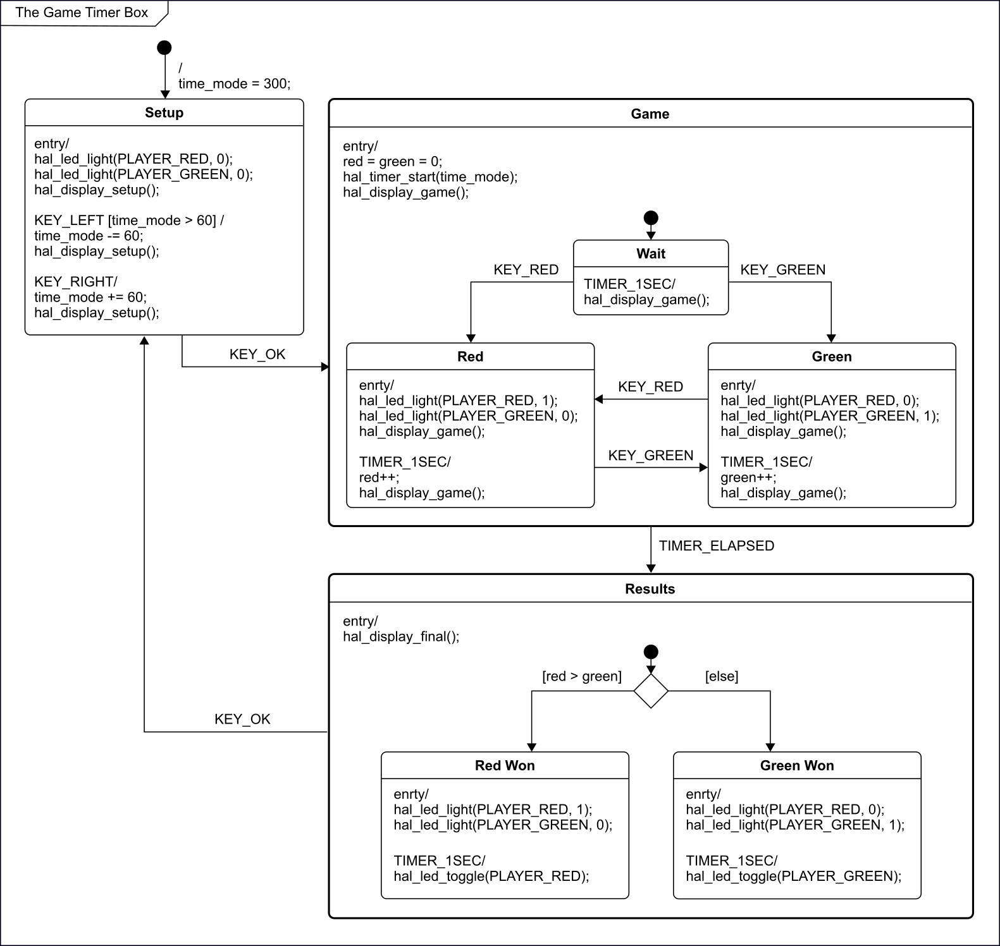
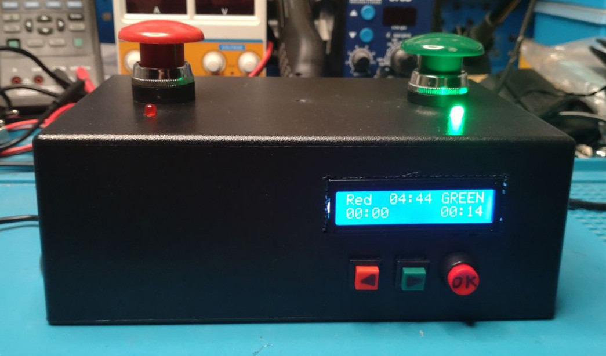
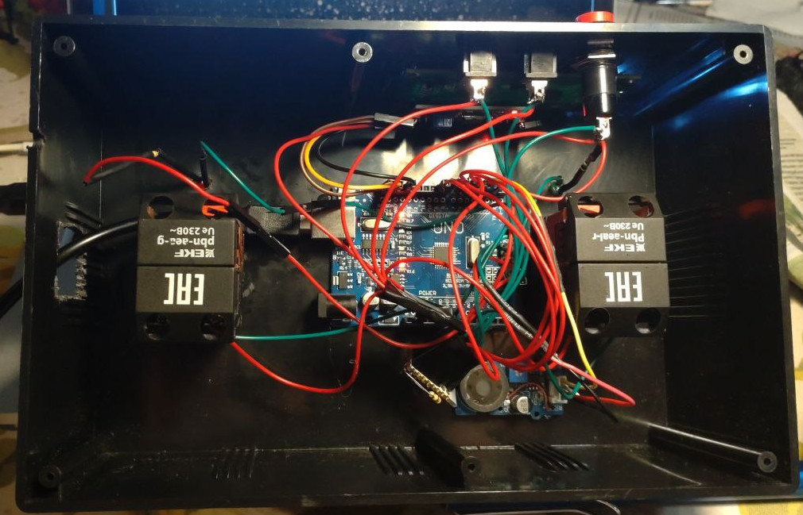

# The Game Timer Box

The simple game timer box based on Arduino and HSM logic.

The code is distributed under the GNU Public License (version 3).

## The Software

The box is programmed by the code based on this HSM diagram:

The simple SM dispatcher for Arduino was implemented to support this logic.

## The Hardware

The box contains buttons, LEDs, small LCD, and simple sound player:

The hardware is based on Arduino controller:

The electric circuit diagram will be published soon.

## Requirements

* LCD library: https://github.com/blackhack/LCD_I2C/
